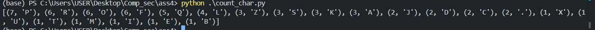
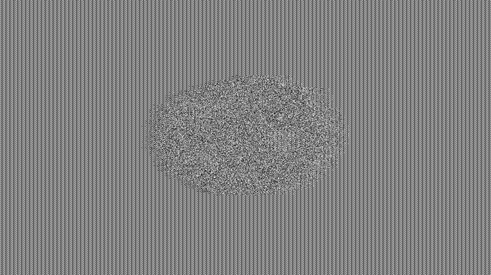
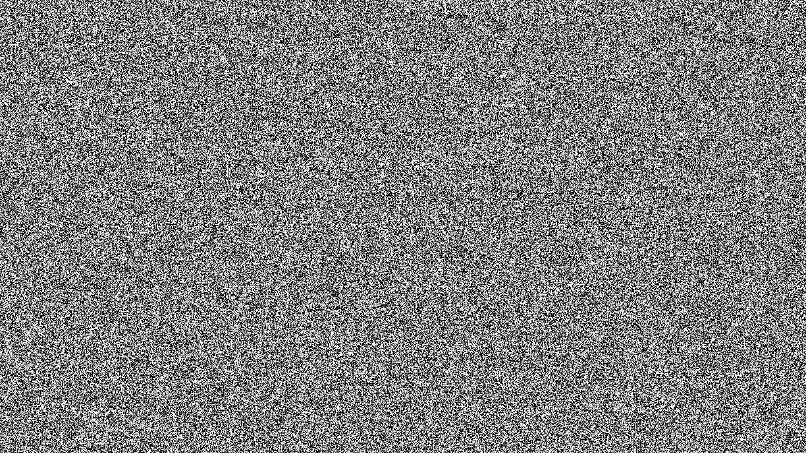

#### 1. (Cryptanalysis) Though encryption is primarily designed to preserve confidentiality and integrity of data, the mechanism itself is vulnerable to brute force (statistical analysis). In other words, the more we see the encrypted data, the easier we can hack it. In this exercise, you are asked to crack the following cipher text. Please provide the decrypted result and explain your strategy in decrypting this text.

from CIPHER text: PRCSOFQX FP QDR AFOPQ CZSPR LA JFPALOQSKR. QDFP FP ZK LIU BROJZK MOLTROE.

##### 1.a: Count the frequency of letters. List the top three most frequent characters.


Answer: top3 คือ P, R, O, F, Q ตามลำดับจาก มากไปน้อยที่จำนวน 7,6,6,6,5 ตามลำดับจะได้ว่าอันดับ 1 คือ P, 2 คือ R,O,F อันดับ 3 คือ Q

##### 1.b: Knowing that this is English, what are commonly used three-letter words and two-letter words. Does the knowledge give you a hint on cracking the given text?

Answer: 2 letters woprds ที่นิยมใช้ในภาษาอังกฤษ คือ: OF, TO, IN, IS, IT, HE, AS, ON, AT, BY, AN, BE, OR, SO, UP, NO, DO, IF
3 letters words ที่นิยมใช้ในภาษาอังกฤษคือ: THE, AND, FOR, ARE, BUT, NOT, YOU, ALL, ANY, CAN, HAD, HER, WAS, ONE, OUR, OUT, OLD
ได้เพราะ คำภาษางอักฤษ ที่มีสองตัวอักษร สามารถ เป็นได้เช่น Is, am, he, it แต่ด้วยตัวอย่างเช่น FP ไม่ได้อยู่ต้นประโยค อาจจะเป็นพวก verb ช่วยเช่น is หรือ am, แต่ LA และ ZK ไมไ่ด้อยู่ต้นประโยคน่าจะเป็นคำประเภทที่เป็น adjective หรือ adverb, อีกทั้งคำสามตัวอักษร สามารถเป็นได้บางคำเช่น the, are, you ซึ่งจากการที่ QDR อยู่หลัง FP เป็นไปได้ที่จะเป็นคำว่า the, แต่ LIU อยู่ในส่วนกลางของประโยคอาจจะเป็นคำอื่นได้ ถ้า assume ว่า FP เป็น is และ QDR คือ the จะได้ว่า QDFP คือ this ซึ่งเป็นคำที่มักอยู่ตรงต้นประโยคแล้วตามด้วย is จริง

##### 1.c: Cracking the given text. Measure the time that you have taken to crack this message.

Q=t, D=h, F=i, P=s, R=e

จาก เงื่อนไขนี้จะแกะรหัสได้ประมานนี้
se \_ \_ _ i t _ is the _ i _ st \_ \_ _ se _ \_ _ is _ \_ _ t _ _ e. this is _ \_ \_ \_ \_ _ e _ \_ \_ \_ \_ \_ \_ _ e _ \_

ซึ่งคำแรกดูเหมือนจะเป็นคำว่า security จะได้ว่า C=c, S=u, O=r, X=y, Q=t, D=h, F=i, P=s, R=e
จะแกะออกมาเพิ่มได้ว่า: SECURITY IS THE \_IRST C_USE ** \_IS**RTU_E. THIS IS ** \_** \_ER**\_ \_R**ER\_.

จะได้เพิ่มเติมว่า A มาจาก f ทำให้ AFOPQ ตือ first, และ Z คือ a จาก CZSPR คือ cause
จะแกะออกมาเพิ่มได้ว่า: SECURITY IS THE FIRST CAUSE _F \_ISF_RTU_E. THIS IS A_ **\_ *ER_A* \_R**ER\_.

จะได้เพิ่มเติว่า L มาจาก O เพราะ LA คือ of
จะแกะออกมาเพิ่มได้ว่า: SECURITY IS THE FIRST CAUSE OF _ISFORTU_E. THIS IS A_ O\_\_ _ER_A_ _RO_ER_.

จะได้เพิ่มเติว่า J มาจาก M, K คือ n เพราะ JFPALOQSKR คือ misfortune
จะแกะออกมาเพิ่มได้ว่า: SECURITY IS THE FIRST CAUSE OF MISFORTUNE. THIS IS AN O\_\_ _ERMAN \_RO_ER_.

จะได้เพิ่มเติว่า B มาจาก G เพราะ BROJZK คือ german
จะแกะออกมาเพิ่มได้ว่า: SECURITY IS THE FIRST CAUSE OF MISFORTUNE. THIS IS AN O\__ GERMAN \_RO_ER_.

จากการคาดเดาว่า O** อยู่หลัง an น่าจะเป็น adjective จะได้เพิ่มเติว่า I คือ l, U คือ d เพราะ LIU คือ old
จะแกะออกมาเพิ่มได้ว่า: SECURITY IS THE FIRST CAUSE OF MISFORTUNE. THIS IS AN O** GERMAN _RO_ER_.

จะขาด 3 ตัวอักษณ คือ E, M, T ใน Cipher และ ลอง สุ่มมาเพิ่มเติมว่า คำอะไรเป็น _RO_ER_ ซึ่งเดาเป็น proverb เลยจะได้เป็น
SECURITY IS THE FIRST CAUSE OF MISFORTUNE. THIS IS AN OLD GERMAN PROVERB.

Answer: จากเวลาที่ผมใช้ในการทำแบบ manual ผมใช้เวลาประมาน 30-40 นาทีซึ่งได้ผลลัพธ์ออกมาเป็น ประโยคว่า SECURITY IS THE FIRST CAUSE OF MISFORTUNE. THIS IS AN OLD GERMAN PROVERB.

##### 1.d: Create a simple python program for cracking the Caesar cipher text using brute force attack. Explain the design and demonstrate your software. (You may use an English dictionary for validating results.)

Answer: จากนิยามของ caesar cipher มี fix range shift เท่ากันในทุก character โดย code เป็นดังนี้

```python
# Caesar Cipher Brute Force with Dictionary Validation (Exercise 1.d)

# 1. พจนานุกรมคำศัพท์ภาษาอังกฤษที่พบบ่อย สำหรับใช้ตรวจผลลัพธ์
DICTIONARY = {
    "THE", "BE", "TO", "OF", "AND", "A", "IN", "THAT", "HAVE", "I",
    "IT", "FOR", "NOT", "ON", "WITH", "HE", "AS", "YOU", "DO", "AT",
    "THIS", "BUT", "HIS", "BY", "FROM", "THEY", "WE", "SAY", "HER",
    "SHE", "OR", "AN", "WILL", "MY", "ONE", "ALL", "WOULD", "THERE",
    "THEIR", "WHAT", "SO", "UP", "OUT", "IF", "ABOUT", "WHO", "GET",
    "WHICH", "GO", "ME", "IS", "HELLO", "WORLD", "SECRET", "SECURITY"
}


# 2. ฟังก์ชันถอดรหัส Caesar สำหรับ 1 ค่า Shift
def decrypt(text, shift):
    result = ""
    for char in text:
        if char.isalpha():
            # หาจุดเริ่มต้น ('A' หรือ 'a')
            base = ord('A') if char.isupper() else ord('a')
            # เลื่อนตัวอักษรถอยหลังตาม shift
            result += chr((ord(char) - base - shift) % 26 + base)
        else:
            result += char
    return result


# 3. ฟังก์ชันหลักสำหรับ Brute Force หาค่า Shift
def crack_caesar(ciphertext):
    print(f"Ciphertext: {ciphertext}\n")
    print("--- Testing all 26 possible shifts ---")

    best_shift = 0
    best_text = ""
    max_matches = -1

    for shift in range(26):
        plain = decrypt(ciphertext, shift)

        # ตัดคำและลบเครื่องหมายวรรคตอนรอบๆ ออก
        words = [w.strip(".,!?\"'") for w in plain.upper().split()]

        # นับว่ามีคำที่ตรงกับ Dictionary กี่คำ
        matches = sum(1 for w in words if w in DICTIONARY)

        print(f"Shift {shift:2d} (Matched {matches:2d} words): {plain}")

        # เก็บคำตอบที่พบคำภาษาอังกฤษมากที่สุด
        if matches > max_matches:
            max_matches = matches
            best_shift = shift
            best_text = plain

    print("\n" + "=" * 50)
    print(f"Best Result: Shift {best_shift} (Matched {max_matches} English words)")
    print(f"Decrypted Text: {best_text}")
    print("=" * 50)


# 4. ทดสอบโปรแกรม
if __name__ == "__main__":
    # ตัวอย่างข้อความที่เข้ารหัสด้วย Caesar Cipher (Shift = 3)
    sample_ciphertext = "PRCSOFQX FP QDR AFOPQ CZSPR LA JFPALOQSKR. QDFP FP ZK LIU BROJZK MOLTROE."
    crack_caesar(sample_ciphertext)
```

ผลลัพธ์คือ

```bash
==================================================
ผลลัพธ์ที่ดีที่สุดคือ Shift 23 (พบคำภาษาอังกฤษ 2 คำ)
Decrypted Text: SUFVRITA IS TGU DIRST FCVSU OD MISDORTVNU. TGIS IS CN OLX EURMCN PROWURH.
==================================================
```

จะเห็นว่าการคิดโดยมอง Cipher นี้เป็นแบบ caesar cipher มันไม่ถูกต้องเพราะการกำหนด fix range shift ไม่สามารถ decrypt ออกมาได้ทำให้เรารู้ได้ว่ามันไม่ได้เป็น Caesar Cipher

โดย design จะใช้การกำหนดค่าที่จะ shift ในแต่ละ character อย่างละเท่ากันตามหลักการ Caesar Cipher แล้วทำการ shift โดยใช้ตามค่าตัวเลขที่เราจะ shift แล้วเอาผลลัพธ์ที่ shift แต่ละ ค่าออกมาเทียบโดยทำการตัด split คำด้วย space ในประโยคแล้วเทียบว่าแต่ละคำมีคำไหนตรงบ้างใน dictionary ซึ่งจะเห็นว่าแม้จะ shift ทุกค่าแล้วก็ยังมีเพียงแค่สองคำที่ตรงใน dictionary คือ FP มาจาก is ซึง fix range shift เท่ากันคือ 23 แม้ดูเหมือนว่าการ brute force จะไม่ได้ผลกับ Cipher แต่ถ้าเราดูจริงๆแล้ว ถ้าเรามี dictionary ที่ใหญ่พอและ ไม่มองเป็น Caesar Cipher แบบ classical รวมถึงมี compute power ที่มากพอย่อมสามารถคำนวณโดยการ brute force ได้

#### 2. (Cryptanalysis on Symmetric Encryption) Vigenère is a complex version of the Caesar cipher. It is a polyalphabetic substitution.

##### 2.a: Please review Kasiski examination Explain how it can be used to attack Vigenère.

Answer: จาก Kasiski examination พบว่าถ้าเราได้รับ Cipher text มาเยอะๆ แล้วดูว่า มีคำไหนซ้ำกันบ่อยๆบ้าง เขาพบว่า การที่มีคำซ้ำกันเกิดจากการที่ key วนครบรอบพอดีแล้วเริ่ม ตัวอักษรแรกของ key เหมือนกัน โดยยกตัวอย่างสถานการณ์ดังนี้

```
DLC xxx xxx DLC xxx
```

จะเห็นว่า index ที่ 0 และ 9 เจอคำเดียวกันคือ DLC และ DLC ตามลำดับ ซึ่ง distance คิดเป็น 9-0 = 9 จะได้ว่า ความยาวของ key จะต้องหาร 9 ลงตัว เช่น 1, 3, 9 ทำให้เรารู้ความยาวของ key คร่าวๆแล้วเราก็ค่อยๆตัด ความยาวที่เป็นไปไม่ได้ทิ้ง เช่นถ้า m (ความยาว) = 1 จะกลายเป็นว่ามันคือ Caesar Cipher ปกติก็ brute force fix range shift ได้เลยถ้า m = 1ไม่สามารถ decrypt ได้ก็ให้ลอง m = 3 และ m = 9
โดยเราสามารถดูได้ว่ามีคำอื่นซ้ำมั้ย ถ้าซ้ำ แล้ว 3 กับ 9 ยังอยู่ในความยาวที่เป็นไปได้มั้ย ถ้าตัวไหนเป็นไปไม่ได้ก็ตัดตัวนั้นทิ้ง แต่ถ้าสุดท้ายยังเหลือความยาวที่เป็นไปได้อยู่ให้เลือกมากกว่า 2 แบบก็ brute force โดยการ มองการ encrypt เป็นเสมือน caesar cipher แต่ เลือกตำแหน่งมาทำ เช่น จาก ตัวอย่าง index ที่ 0, 3, 6, 9, 12, ... จะเป็นตัวอักษร ที่ encrypt ด้วย key ตัวแรกเสมอแล้วก็ decrypt โดย shift ทั้งหมด 26 แบบแล้วดูว่า shift ค่าไหนที่ทำให้ตรงกับสถิติของตัวอักษรภาษาอังกฤษมากที่สุด เช่นจาก สถิติ e จะอยู่ในคำภาษาอังกฤษเยอะที่สุด แล้วถ้า shift value ที่ 10 แล้ว e เยอะที่สุดกว่าตัวอักษรอื่นจริงก็สามารถสรุปได้ว่า shift value นั้นคือ ค่าที่ key ใช้ shift ไปแล้วก็ทำแบบนี้กับทุก ตัวใน key ไปจนถึง 3 หรือ 9 ตัวอักษร ทำให้เวลาที่ใช้ จาก 26^m เป็น 26\*m

#### (Mode in Block Cipher) Block Cipher is designed to have more randomness in a block. However, an individual block still utilizes the same key. Thus, it is recommended to use a cipher mode with an initial vector, chaining or feedback between blocks. This exercise will show you the weakness of Electronic Code Book mode which does not include any initial vector, chaining or feedback.

##### 3.a: Find a bitmap image that is larger than 2000x2000 pixels. Note that you may resize any image. To simplify the pattern, we will change it to bitmap (1-bit per pixel) using the portable bitmap format (pbm). In this example, we will use imagemagick for the conversion.

```bash
$ magick convert images.jpg -resize 2000x2000 org.pbm
```

**Original Image (Base):**


##### 3.b: The NetPBM format is a naive image format.The first two lines contain a header (format and size in pixel). Depending on the format, the pixels can be represented in either binary and ascii. For our exercise, we prefer binary. However, we first have to take out the header to prevent the encryption from encoding the header. To do so, use your text editor (eg. vi, notepad) to take out the first two lines.

```bash
$ cp org.pbm org.x
$ vi org.x
```

##### 3.c: Encrypt the file with OpenSSL with any block cipher algorithm in ECB mode (no padding and no salt).

```bash
$ openssl enc -aes-256-ecb -in org.x -nosalt -out enc.x
```

##### 3.d: Pad the header back and see the result.

```bash
$ cp enc.x enc.pbm
$ vi enc.pbm
# หรือใช้คำสั่ง:
# head -n 2 org.pbm > header.txt
# cat header.txt enc.x > enc.pbm
# magick enc.pbm enc.png
```

**ECB Result (`enc.png`):**


##### 3.e: You may try it with other modes with IV, chaining, or feedback and compare the result.

ทดลองเข้ารหัสด้วย **AES-256-CBC Mode**:

```bash
$ openssl enc -aes-256-cbc -in org.x -nosalt -out enc_cbc.x -k 1234
$ cat header.txt enc_cbc.x > enc_cbc.pbm
$ magick enc_cbc.pbm enc_cbc.png
```

**CBC Result (`enc_cbc.png`):**


---

#### สรุปเปรียบเทียบผลลัพธ์ (Visual Comparison):

| Original Image (`images.jpg`) | AES-256-ECB (`enc.png`) | AES-256-CBC (`enc_cbc.png`) |
| :---------------------------: | :---------------------: | :-------------------------: |
|  |     |     |

---

##### 3.f: What does the result suggest about the mode of operation in block cipher? Please provide your analysis.

Answer: จากผลลัพธ์จะเห็นว่า images ไปผ่าน encrypt ด้วย ECB จะเห็น pattern บางอย่างว่าภาพดูเหมือนจะเป็น wallpaper บางอย่างที่มีตัวอะไรอยู่ตรงกลาง และรอบๆเป็นพื้นหลังเหมือนๆกัน แต่เมื่อเทียบกับ CBC จะเห็นว่าภาพดูไม่ออกเลยว่าเป็นภาพอะไร ซึ่งตอบย้ำว่าทำไม ECB ถึงไม่สามารถใช้งานได้เมื่อเจอภาพเป็นแบบ pattern โดยถ้าเราดูที่ภาพต้นฉบับจะเห็นว่า ภาพเป็น wallpaper ที่มีตัวการ์ตูนอยู่ตรงกลางและรอบๆภาพเป็น background เหมือนๆกันโดย ECB จะแบ่ง plain text เป็น block แล้วนำทีละ block ไป encrypt ด้วย key เดียวกัน จนได้ออกมาเป็น Cipher text ของแต่ละ block ปัญหาก็คือว่าถ้า block แต่ละ block เหมือนกันผลลัพธ์ของ Cipher text จะหน้าตาเหมือนกันโดยดูจาก ECB จะเห็นว่า background รอบบๆหน้าตาของ encrypt รูปที่ออกมาเหมือนกันมากๆ จนดูออกเป็น pattern แต่เมื่อเทียบกับ CBC ที่นำ output cipher text ก่อนหน้าไป xor กับ plain text ของ block ถัดไปแล้วถึงค่อยผ่าน encryption ทำให้ความเป็น pattern หายไป เพราะหน้าตาของ block ที่ก่อนจะผ่าน encryption ถูกเปลี่ยนแปลงจาก Cipher text ของ block ก่อนหน้าด้วย xor operation ซึ่งก็คือการ encryption ทำให้ความเป็น pattern ถูกทำลายโดยผลลัพธ์จะเห็นว่าดูไม่ออกเลยว่าเป็นภาพอะไร

#### 4.(Encryption Protocol - Digital Signature)

##### 4.a: Measure the performance of a hash function (sha1), RC4, Blowfish and DSA. Outline your experimental design. (Please use OpenSSL for your measurement)

Answer:

#### 1. Experimental Design (การออกแบบการทดลอง)

- **สภาพแวดล้อมที่ใช้ทดสอบ (Environment):** WSL (Ubuntu/Linux), OpenSSL 3.x
- **ไฟล์ทดสอบ (Input Dataset):** ไฟล์ข้อความ `text.txt` (ขนาด 1.6 MB) เป็น text ที่ parse มาจากนวนิยาย Sea-Of_dreams.pdf ที่แจกฟรีแล้ว double เนื้อหาเข้าไปเพื่อเพิ่มขนาด
- **เกณฑ์การวัดผล (Metric):** ใช้คำสั่ง `time` วัดระยะเวลาประมวลผลจริง (`real` time) หน่วยเป็นวินาที (Seconds)
- **วิธีการทดลอง:** ทำการทดสอบแต่ละอัลกอริทึมจำนวน **3 ครั้ง (Trials)** เพื่อหาค่าเฉลี่ย (Average Time) และลดความคลาดเคลื่อนจาก System Caching

---

#### 2. ตารางบันทึกผลการทดสอบ (Performance Measurement Table)

| Algorithm    | Category / Type   | Trial 1 (s) | Trial 2 (s) | Trial 3 (s) | Average Time (s) |    Throughput / ความเร็ว     |
| :----------- | :---------------- | :---------: | :---------: | :---------: | :--------------: | :--------------------------: |
| **SHA-1**    | Hash Function     |    0.070    |    0.082    |    0.066    |      0.073       |           เร็วมาก            |
| **RC4**      | Stream Cipher     |    0.276    |    0.203    |    0.188    |      0.222       |           ปานกลาง            |
| **Blowfish** | Block Cipher      |    0.203    |    0.202    |    0.206    |      0.204       |           ปานกลาง            |
| **DSA**      | Digital Signature |    0.069    |    0.073    |    0.071    |      0.071       | เร็วมาก (Hash + Sign Digest) |

---

_(รายละเอียดเวลาแยกตาม real / user / sys)_

| Algorithm    | Trial 1 (`real` / `user` / `sys`) | Trial 2 (`real` / `user` / `sys`) | Trial 3 (`real` / `user` / `sys`) | Average Real (s) |
| :----------- | :-------------------------------: | :-------------------------------: | :-------------------------------: | :--------------: |
| **SHA-1**    |     0.070s / 0.000s / 0.014s      |     0.082s / 0.004s / 0.009s      |     0.066s / 0.000s / 0.014s      |      0.073s      |
| **RC4**      |     0.276s / 0.017s / 0.017s      |     0.203s / 0.000s / 0.032s      |     0.188s / 0.030s / 0.001s      |      0.222s      |
| **Blowfish** |     0.203s / 0.030s / 0.015s      |     0.202s / 0.021s / 0.021s      |     0.206s / 0.007s / 0.035s      |      0.204s      |
| **DSA**      |     0.069s / 0.019s / 0.000s      |     0.073s / 0.000s / 0.016s      |     0.071s / 0.010s / 0.005s      |      0.071s      |

##### 4.b: Comparing performance and security provided by each method.

Answer: จากผลการทดลองจะเห็นว่า Performance ของ SHA1 กับ DSA พอๆกันอยู่ที่ประมาน 0.073s และ 0.071s ซึ่งสาเหตุเป็นผล คำสั่งที่ใช้ทดสอบ DSA ผมทดสอบด้วยการนำ text file ไปผ่าน hash ที่คำนวณร่วมกับ private key ที่ผ่้านกาสร้างมาก่อนแล้ว แล้วพอไปผ่านการคำนวณแบบ Asymmetrics ด้วย private key ที่ขนาดแค่ 160 bit ทำให้ bottle neck จริงๆของ process นี้อยู่ที่ hash function เป็นหลัก นั้นเป็นเหตุผลที่เวลาของ DSA พอๆกับ Sha-1 โดยที่สาเหตุที่ hash function ทำงานไวเพราะใช้การดำเนินทาง operation พื้นฐานเช่น bitwise shift และ function อื่นๆ ไม่ต้องมีการคำนวณหรือใช้หน่วยความจำเหมือน Cipher ทั้งสองแบบเลยไวกว่าทั้ง RC4 และ Blowfish และผลการทดลอง Rc4 และ blow fish ใช้เวลาพอๆกัน อยู่ที่ 0.222 และ 0.204 เพราะทั้งสอง encryption จองพื้นที่เพิ่มเติมเช่น RC4 เกิดจากเวลาที่ใช้ในการเขียนข้อมูลลง disk ซึ่งช้า ด้วยการที่เขียน disk กินเวลา I/O time ตามหลัก Computer architecture ส่วน Blowfish ต้องมีการอ่านไฟล์ 1.6mb เหมือนกันแต่ต้องเขียนไฟล์ ออกมาด้วยขนาด 1.6Mb ซึ่งเยอะกว่าที่ SHA-1 หรืิอ DSA ทำเพราะ ทั้งสอง write file แค่ขนาดไม่ใหญ่มากเพราะ ผ่าน hash function มาก่อนด้วยสาเหตุนี้เวลาส่วนใหญ่ของ Rc4 และ Blowfish เสียไปกับ I/O time

ด้าน securities: SHA1 ไม่ปลอดภัย เพราะ hash function มีงานวิจัยแล้วว่าสามารถ สร้างข้อมูล 2 แบบที่ต่างกันแต่ให้ผลลัพธ์ hash เหมือนกันได้ทำให้ hacker สามารถปลอมแปลงเอกสารได้ ส่วน RC4 ไม่ปลลอดภัย เพราะ มาจาก Stream Cipher ซึ่ง RC4 สามารถถูก โจทตีได้ง่ายถ้าเราเก็บข้อมูลมาเยอะๆพอ เพราะ ความเอนเอียงทางสถิติ ทำให้เราสามารถคาดเดาความสัมพันธ์กับ key ได้ก็สามารถคาดเดา key ที่ RC4 ใช้ extend ได้ โดยมี case ตัวอย่างที่นำ RC4 ไปใช้กับ network securities แล้วข้อมูลหลุดกระจายโดยใช้วิธีรับข้อมูลเยอะๆจากการมีเสาสัญญาณ แล้วเอาข้อมูลมาคาดเดา key ส่วน Blowfish เริ่มล้าสมัย เพราะ ตัว block มีขนาดเล็กเกินไปทำให้แม้ การ encrypt แบบแบ่งกล่องจะปลอดภัย แต่ เพราะ เมื่อข้อมูลมีขนาดใหญ้เกินไป ทำให้ กล่องที่ผ่าน encrypt จะเริ่มหน้าตาคล้ายกันมากขึ้นจนนำไปสู่การคาดรหัสได้ โดยเฉพาะยุคปัจจุบันที่ขนาดไฟล๋ใหญ่มากๆ ทำให้ blowfish มีโอกาสเจอกล่องซ้ำกันเยอะมากๆ ส่วน DSA เริ่มล้าสมัยเพราะ ต้องมีการสุ่มเลข k ขึ้นมาตามหลักคณิตศาสตร์ ซึ่งถ้าเกิดเอกสาร 2 ฉบับสุ่ม k ได้ซ้ำกัน hacker สามารถคำนวณย้อนกลับเพื่อขโมยprivate key ได้อีกทั้งก็เปลือง compute มากๆ ด้วยถ้าข้อมูลมีขนาดใหญ่

##### 4.c: Explain the mechanism underlying Digital Signature. How does it combine the strength and weakness of each encryption scheme?

Answer: ต้องมีการ signing process และ verify process โดย signing process จะนำ message ไปผ่าน hash function แล้ว นำ ผลลัพธ์นี้ไปใช้ generate signature ด้วย private key ของผู้ส่ง แล้วส่ง message นี้ที่ผ่าน hash และ signature นี้ไปพร้อมกับ public key ส่้งไปให้ผู้รับ จากนั้นผู้รับจะทำ verify process โดยจะนำ public key ของผู้ส่งมา ถอดรหัสเพื่อ authentication ว่าผู้ส่งนั้นคนส่งมาคือผู้ส่งที่เราต้องการจริงๆ จากนั้นถ้ายืนยันแล้วจะ ทำการ นำ message ที่ได้รับมาผ่าน hash function ตัวเดียวกันและ ยืนยันว่า digital signature ที่แนบมาถอยรหัสด้วย public key ได้และตรงกับ message ที่ผ่าน hash มามั้ยถ้าตรงกัน ก็ถือว่า integrity ผ่านและทำให้ authentication ได้ด้วยว่าคนส่งมาคือใคร

Digital signature ได้ใช้สอง encryption ในการทำสิ่งนี้คือ 1. public key cryptography เพราะ ใช้จุดแข็งที่มีผู้เดียวที่ถือ private key ทำให้สามารถ scale ได้ด้วยการแจก public key ให้ใครก็ได้แล้วใช้ publice key verify ว่า message มาจากผู้ส่งถูกต้องจริงมั้ย แต่เพราะมีข้อเสียด้าน ประมวลผลช้ามากกับข้อมูลขนาดใหญ่ เพราะใช้คณิตสาร์เข้ารหัสเลยช้ามากๆ ถ้าไฟล์มีขนาดหใญ่หรือข้อมูลมีขนาดใหย่เลยแก้ปัญหาด้วย encryption ที่ สอง 2. Hash function โดยใช้จุดแข็งที่ประมวลผลได้เร็ว และย่อข้อมูลจากขนาดใหญ้มากๆเป็นเล็กมากๆได้ ซึ่งข้อเสียมันคือ ไม่มีกุญแจใครก็คำนวณ hash function ได้ ไม่มี integrity ด้วย ซึ่งพอรวมสองอย่างนี้เข้าด้วยกัน ทำให้ เมื่อ message ไปผ่น hash function จนข้อมูลมีขนาดเล็กลง แล้วไปเข้ารหัสด้วย private key ของ public key cryptography ทำให้ สามารถมี integrity และ authentication ขณะที่ยัง maintain ความเร็วในการ encrypt decrypt ได้อยู่
