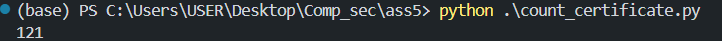
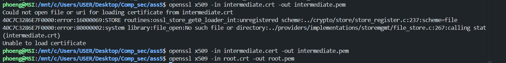

#### 1. From the two given openssl commands, what is the difference?
```bash
openssl s_client -connect www.chula.ac.th:443 -CApath empty_dir

# and 
openssl s_client -connect ww.chula.ac.th:443 -CAfile ca-certificates.crt
```
Answer: แตกต่างกันเพราะ ทั้งสองคำสั่งมันก็คือการทำ TLS Handshake สำหรับ HTTPS protocol เพื่อให้สามารถ http หากันได้โดยที่ คำสั่งแรกจะอ้างอิง CApath เพื่อจำลองว่า CAfile ที่เราจะหาว่า Certificate ที่ส่งมาเรารู้จักและเชื่อถือมั้ย ซึ่งพอแนบ folder ว่างให้มัน มันก็ไม่รู้จัก Certificate นี้ทำให้ return status 20 ว่าไม่รู้จัก certificate นี้กลับมา แต่ถ้าระบุ CAfile ca-certificates.crt ที่อยู่ในระบบ เพื่อยืนยันว่า certificate ที่ www.chula.ac.th ส่งมานั้นเรารู้จักมั้ยโดยดูจาก ca-certificates.crt ที่เป็นค่า default อยู่แแล้วก็จะ return status 0 กลับมาเพื่อบอกว่า ok ผ่านการยืนยัน certificate โดย CApath empty_dir เป็นการชี้ไปยัง directory ที่เก็บไฟล์ Certificate CA ที่รับรองเชื่อถือได้, CAfile ca-certificates.crt เป็นการชี้ไปยังไฟล์ โดยตรงที่รวม Root CA ที่เชื่อถิอได้ รับรองได้ เข้าไว้ด้วยกันแล้วใช้ทำ Chain of trust ได้


#### 2. What does the error (verify error) in the first command mean? Please explain.
Answer:  Error: `Verify return code: 20 (unable to get local issuer certificate)` กลับมาเพื่อบอกว่าหา Root CA Certificate นี้ไม่เจอเนื่องจากไม่รู้จัก Root CA Certificate จากฐานข้อมูลที่แนบให้ โดยการที่แนบ Empty_dir คือการจำลองว่าถ้าเราไม่แนบฐานข้อมูลให้เสมือนว่าไม่มี ข้อมูล Root CA Certificate นี้

#### 3. Copy the server certificate (beginning with -----BEGIN CERTIFICATE----- and ending with -----END CERTIFICATE-----) and store it as twitter_com.cert. Use the command openssl x509 -in twitter_com.cert -text to show a text representation of the certificate content. Briefly explain what is stored in an X.509 certificate (i.e. data in each field).
**Answer**:
- Version: เวอร์ชันของมาตรฐาน X.509
- Serial Number: หมายเลขประจำตัวเฉพาะของใบรับรองนี้ ออกโดย CA เพื่อไม่ให้ซ้ำกัน                                                                         
- Signature Algorithm: อัลกอริทึมการเข้ารหัสที่ CA ใช้ลงลายมือชื่อดิจิทัล (เช่น sha256WithRSAEncryption)                                                   
- Issuer: ข้อมูลองค์กร/หน่วยงานผู้ออกใบรับรองนี้ (เช่น Sectigo Public Server Authentication CA DV R36)                                                
- Validity: ช่วงเวลาที่ใบรับรองมีผลบังคับใช้ ระบุวันเริ่มใช้งาน (Not Before) และวันหมดอายุ (Not After)                                                     
- Subject: ข้อมูลระบุตัวตนของผู้ถือครองใบรับรอง (ในที่นี้คือ CN=*.chula.ac.th)                                                                           
- Subject Public Key Info: ข้อมูลเกี่ยวกับ Public Key ของผู้ถือใบรับรอง ประกอบด้วย Public Key Algorithm (RSA 2048-bit) และค่า Public Key               
- Signature Value: ลายมือชื่อดิจิทัลของ CA ที่สร้างจากการ Hash ข้อมูลในใบรับรองแล้วเข้ารหัสด้วย Private Key ของ CA
-  X509v3 key usage จะบอกว่า public key เอาไปทำอะไรได้บ้าง เช่น Digital signature เอาไว้ authen และ key encipherment เอาไว้เข้ารหัส symmetric key ตอนทำ TLS
- X509v3 Basic constraints: End-entity เพื่อบอกว่า เอาไปใช้ออก certificate ต่อไม่ได้
- Subject key identifier เป็น ค่า่ hash ของ public key
- Authority Key Identifier เป็น key identifier ใช้สำหรับจับคู่ subject key identifier ของ certificate CA
- Authority Information Access เป็น URL ที่ใช้ download Intermidiate CA ได้
- X509v3 subject Althernative name: ระบุ domain name ที่ certificate นี้ครอบคลุม
- X509v3 Certificate Policies: บอกมาตรฐานความเข็มงวดใยการของใบรับรองของ CA นี้


#### 4. From the information in exercise 3, is there an intermediate certificate? If yes, what purpose does it serve?
Answer: มีโดยดูจาก Authority Information Access โดยจะเป็นลิ้ง endpoint url ให้เราไป donwload มาได้ซึ่งได้ file ชื่อ SectigoPublicServerAuthenticationCADVR36.crt โดย Intermidate certificate มีไว้เพ่อให้ ทำ Chain of trust ได้เช่นใน OS ของเราหรือ web browser จะมี list CA ที่เราเชื่อถืออยู่ ถ้า website ที่เราจะเข้าถึงไปขอรับรองจาก root CA โดยตรงจะทำให้ root CA ต้องรองรับคนมาขอเป็นจำนวนมากเขาเลยทำการให้ certificate บางคน แล้วคนๆนั้นจะเป็น child ของ Root CA นั้นทำให้คนๆนั้นสามารถที่จะทำหน้าที่ในการออกใบรับรองให้คนอื่นต่อได้ ซึ่งในกรณีนี้ ก็คือ www.chula.ac.th ได้รับรองจาก intermediate CA แล้ว Intermediate CA ได้รับรองจาก Root CA อีกทีนึงทำให้ Scalability อีกทั้งด้านความปลอดภัย ช่วยปกป้อง Root CA โดยทำให้ Root CA สามารถเก็บ private key โดยไม่ต้องต่อ Internet เพื่อออกใบรับรองทุกวันจากเหตุผลข้อที่แล้ว ทำให้ถ้า Intermediate CA ถูกโจมตีก็สามารถ ถอน Certificate นั้นจาก Root CA โดยไม่ต้องยุ่งกับ Root CA ทั้งระบบ
โดยมี certificate เป็นดังนี้ โดย Intermediate CA นี้เป็น 

```txt
-----BEGIN CERTIFICATE-----
MIIGTDCCBDSgAwIBAgIQOXpmzCdWNi4NqofKbqvjsTANBgkqhkiG9w0BAQwFADBf
MQswCQYDVQQGEwJHQjEYMBYGA1UEChMPU2VjdGlnbyBMaW1pdGVkMTYwNAYDVQQD
Ey1TZWN0aWdvIFB1YmxpYyBTZXJ2ZXIgQXV0aGVudGljYXRpb24gUm9vdCBSNDYw
HhcNMjEwMzIyMDAwMDAwWhcNMzYwMzIxMjM1OTU5WjBgMQswCQYDVQQGEwJHQjEY
MBYGA1UEChMPU2VjdGlnbyBMaW1pdGVkMTcwNQYDVQQDEy5TZWN0aWdvIFB1Ymxp
YyBTZXJ2ZXIgQXV0aGVudGljYXRpb24gQ0EgRFYgUjM2MIIBojANBgkqhkiG9w0B
AQEFAAOCAY8AMIIBigKCAYEAljZf2HIz7+SPUPQCQObZYcrxLTHYdf1ZtMRe7Yeq
RPSwygz16qJ9cAWtWNTcuICc++p8Dct7zNGxCpqmEtqifO7NvuB5dEVexXn9RFFH
12Hm+NtPRQgXIFjx6MSJcNWuVO3XGE57L1mHlcQYj+g4hny90aFh2SCZCDEVkAja
EMMfYPKuCjHuuF+bzHFb/9gV8P9+ekcHENF2nR1efGWSKwnfG5RawlkaQDpRtZTm
M64TIsv/r7cyFO4nSjs1jLdXYdz5q3a4L0NoabZfbdxVb+CUEHfB0bpulZQtH1Rv
38e/lIdP7OTTIlZh6OYL6NhxP8So0/sht/4J9mqIGxRFc0/pC8suja+wcIUna0HB
pXKfXTKpzgis+zmXDL06ASJf5E4A2/m+Hp6b84sfPAwQ766rI65mh50S0Di9E3Pn
2WcaJc+PILsBmYpgtmgWTR9eV9otfKRUBfzHUHcVgarub/XluEpRlTtZudU5xbFN
xx/DgMrXLUAPaI60fZ6wA+PTAgMBAAGjggGBMIIBfTAfBgNVHSMEGDAWgBRWc1hk
lfmSGrASKgRieaFAFYghSTAdBgNVHQ4EFgQUaMASFhgOr872h6YyV6NGUV3LBycw
DgYDVR0PAQH/BAQDAgGGMBIGA1UdEwEB/wQIMAYBAf8CAQAwHQYDVR0lBBYwFAYI
KwYBBQUHAwEGCCsGAQUFBwMCMBsGA1UdIAQUMBIwBgYEVR0gADAIBgZngQwBAgEw
VAYDVR0fBE0wSzBJoEegRYZDaHR0cDovL2NybC5zZWN0aWdvLmNvbS9TZWN0aWdv
UHVibGljU2VydmVyQXV0aGVudGljYXRpb25Sb290UjQ2LmNybDCBhAYIKwYBBQUH
AQEEeDB2ME8GCCsGAQUFBzAChkNodHRwOi8vY3J0LnNlY3RpZ28uY29tL1NlY3Rp
Z29QdWJsaWNTZXJ2ZXJBdXRoZW50aWNhdGlvblJvb3RSNDYucDdjMCMGCCsGAQUF
BzABhhdodHRwOi8vb2NzcC5zZWN0aWdvLmNvbTANBgkqhkiG9w0BAQwFAAOCAgEA
YtOC9Fy+TqECFw40IospI92kLGgoSZGPOSQXMBqmsGWZUQ7rux7cj1du6d9rD6C8
ze1B2eQjkrGkIL/OF1s7vSmgYVafsRoZd/IHUrkoQvX8FZwUsmPu7amgBfaY3g+d
q1x0jNGKb6I6Bzdl6LgMD9qxp+3i7GQOnd9J8LFSietY6Z4jUBzVoOoz8iAU84OF
h2HhAuiPw1ai0VnY38RTI+8kepGWVfGxfBWzwH9uIjeooIeaosVFvE8cmYUB4TSH
5dUyD0jHct2+8ceKEtIoFU/FfHq/mDaVnvcDCZXtIgitdMFQdMZaVehmObyhRdDD
4NQCs0gaI9AAgFj4L9QtkARzhQLNyRf87Kln+YU0lgCGr9HLg3rGO8q+Y4ppLsOd
unQZ6ZxPNGIfOApbPVf5hCe58EZwiWdHIMn9lPP6+F404y8NNugbQixBber+x536
WrZhFZLjEkhp7fFXf9r32rNPfb74X/U90Bdy4lzp3+X1ukh1BuMxA/EEhDoTOS3l
7ABvc7BYSQubQ2490OcdkIzUh3ZwDrakMVrbaTxUM2p24N6dB+ns2zptWCva6jzW
r8IWKIMxzxLPv5Kt3ePKcUdvkBU/smqujSczTzzSjIoR5QqQA6lN1ZRSnuHIWCvh
JEltkYnTAH41QJ6SAWO66GrrUESwN/cgZzL4JLEqz1Y=
-----END CERTIFICATE-----
```

#### 5.Is there an intermediate CA, i.e. is there more than one organization involved in the certification? Say why you think so
answer:มี Intermediate CA อยู่โดยดูได้ดังนี้ 
- Intermediate Certificate: มี Subject คือ `Sectigo Public Server Authentication CA DV R36` และ Issuer คือ `Sectigo Public Server Authentication Root R46` โดยทั้งคู่ระบุ Organization เป็น `O = Sectigo Limited` โดย Intermediate Certificate นี้ใช้เพื่อเป็นตัวกลางระหว่าง Root CA กับ Server Certificate ของ chula และมีคุณสมบัติ CA:True ซึ่งทำให้ CA นี้สามารถเซ็นรับรองต่อด้วย Certificate ของตัวกลางต่อได้                                                                                 
- Root Certificate: มีทั้ง Subject และ Issuer เป็น `Sectigo Public Server Authentication Root R46` และระบุ Organization เป็น `O = Sectigo Limited`   เช่นเดียวกัน
แสดงว่าทั้ง Intermediate CA และ Root CA ดำเนินการโดยองค์กรเดียวกันคือ "Sectigo Limited" ทั้งหมด ไม่ได้มีองค์กร CA ภายนอกอื่นเข้ามาเกี่ยวข้อง                         

#### 6. What is the role of ca-certificates.crt?
Answer: ทำหน้าที่ในการเป็น file look up ที่เก็บ Root CA ที่น่าเชื่อถือในระดับสากล และมันเอาไปใช้ในการดูว่า Certficate นี้ระบบ OS หรือ browser serach engine เรารู้จักมั้ย โดยหยิบ file นี้ไปเพื่อตรวจสอบความถูกต้องของ Certificate Chain ที่ server ส่งมา ถ้าพบ Root CA certificatae ที่อยู่ในไฟล์ที่เก็บ certficagte ของเราก็จะยอมรับการเชื่อมต่อแบบปลอดภัย

#### 7. Explore the ca-certificates.crt. How many certificates are in there? Give the command/method you have used to count
Answer: ตอบ 121 โดยใช้ code ดังต่อไปนี้
```python
with open("ca-certificates.crt", "r") as f:
    lines = f.readlines()

count = 0

for line in lines:
    if "END CERTIFICATE" in line:
        count+=1
print(count)
```
ผลเป็นดังภาพ


#### 8. Extract a root certificate from ca-certificates.crt. Use the openssl command to explore the details. Do you see any Issuer information? Please compare it to the details of twitter’s certificate and the details of the intermediate certificate.
Answer: ถ้าเรา Root CA certifacte ไปเช็คกับไฟล์ ca-certificates.crt ก็จะพบว่ามี certificate นี้อยู่ในระบบ OS ที่เรารับรองความน่าเชื่อถือทำให้เกิด Chain of Trust เพราะเราเชื่อถือ Root CA โดยผลลัพธ์เป็นดังต่อไปนี้ 
```bash
phoeng@MSI:/mnt/c/Users/USER/Desktop/Comp_sec/ass5$ openssl x509 -in root.crt -text
Certificate:
    Data:
        Version: 3 (0x2)
        Serial Number:
            75:8d:fd:8b:ae:7c:07:00:fa:a9:25:a7:e1:c7:ad:14
        Signature Algorithm: sha384WithRSAEncryption
        Issuer: C = GB, O = Sectigo Limited, CN = Sectigo Public Server Authentication Root R46
        Validity
            Not Before: Mar 22 00:00:00 2021 GMT
            Not After : Mar 21 23:59:59 2046 GMT
        Subject: C = GB, O = Sectigo Limited, CN = Sectigo Public Server Authentication Root R46
```
```bash
(base) PS C:\Users\USER\Desktop\Comp_sec\ass5> wsl
phoeng@MSI:/mnt/c/Users/USER/Desktop/Comp_sec/ass5$ openssl x509 -in intermediate.cert -text
Certificate:
    Data:
        Version: 3 (0x2)
        Serial Number:
            39:7a:66:cc:27:56:36:2e:0d:aa:87:ca:6e:ab:e3:b1
        Signature Algorithm: sha384WithRSAEncryption
        Issuer: C = GB, O = Sectigo Limited, CN = Sectigo Public Server Authentication Root R46
        Validity
            Not Before: Mar 22 00:00:00 2021 GMT
            Not After : Mar 21 23:59:59 2036 GMT
        Subject: C = GB, O = Sectigo Limited, CN = Sectigo Public Server Authentication CA DV R36
```
```bash
phoeng@MSI:/mnt/c/Users/USER/Desktop/Comp_sec/ass5$ openssl x509 -in server_cer.crt -text
Certificate:
    Data:
        Version: 3 (0x2)
        Serial Number:
            e6:38:51:ea:9b:47:2c:6a:4b:f1:24:ce:93:64:6b:cf
        Signature Algorithm: sha256WithRSAEncryption
        Issuer: C = GB, O = Sectigo Limited, CN = Sectigo Public Server Authentication CA DV R36
        Validity
            Not Before: Jan  5 00:00:00 2026 GMT
            Not After : Feb  5 23:59:59 2027 GMT
        Subject: CN = *.chula.ac.th
```
จะเห็นว่า Issuer ของทั้งสาม certificate จะต่างกันขึ้นกับว่าใครเป็นคน ออก certificate ให้โดย Root CA Issuer ก็จะเป็น Sectigo Public Server Authentication Root R46 ซึ่งตรงกับ Subject ทำให้ทราบได้ว่า Certificate นี้คือ Root CA ส่วน Intermediate CA Issuer ก็จะเป็น Sectigo Public Server Authentication Root R46 ซึ่งต่างจาก Subject ที่เป็น Sectigo Public Server Authentication CA DV R36 ทำให้ทราบว่า R46 ออกให้ R36 และ Server Certificate ก็จะเห็นว่า Issuer คือ Sectigo Public Server Authentication CA DV R36 และมี subject เป็น domain *.chula.ac.th ซึ่งทำให้ทราบว่า R36 ออก Certificate นี้ออกให้กับ website ของจุฬาที่มี domain name เป็น .chula.ac.th ทั้งหมด
อีกทั้ง มีแค่ Certificate ของ Chula เท่านั้นที่ CA:False ทำให้ทราบว่า Certificate ของ chula เอาไปรับรองคนอื่นต่อไม่ได้

#### 9. If the intermediate certificate is not in a PEM format (text readable), use the command to convert a DER file (.crt .cer .der) to PEM file. openssl x509 -inform der -in certificate.cer -out certificate.pem. (You need the pem file for exercise 10.)
Abswer: 



#### 10. use below program to verify, 
```python
from OpenSSL import crypto
import pem

def verify_chain_of_trust(cert_pem, trusted_cert_pems):
    certificate = crypto.load_certificate(crypto.FILETYPE_PEM, cert_pem)
    # Create and fill a X509Store with trusted certs
    store = crypto.X509Store()
    for trusted_cert_pem in trusted_cert_pems:
        trusted_cert = crypto.load_certificate(crypto.FILETYPE_PEM, trusted_cert_pem)
        store.add_cert(trusted_cert)
    # Create a X509StoreContext with the cert and trusted certs
    # and verify the chain of trust
    store_ctx = crypto.X509StoreContext(store, certificate)
    # Returns None if certificate can be validated
    try:
        result = store_ctx.verify_certificate()
        if result is None:
            return True
        else:
            return False
    except crypto.X509StoreContextError as e:
        print(f"Verification error: {e}")
        return False

def verify(target_file, intermediate_files, ca_file='./ca-certificates.crt'):
    with open(target_file, 'r') as cert_file:
        cert = cert_file.read()
    
    # โหลด Root CAs จาก ca-certificates.crt
    pems = pem.parse_file(ca_file)
    trusted_certs = [str(mypem) for mypem in pems]

    # Loop เพิ่ม Intermediate CA ทั้งหมดที่มีเข้าไปใน trusted_certs
    for int_file in intermediate_files:
        with open(int_file, 'r') as f:
            trusted_certs.append(f.read())

    # สั่ง Verify ตรวจสอบสายโซ่ความเชื่อถือ
    verified = verify_chain_of_trust(cert, trusted_certs)
    if verified:
        print(f"Certificate verified: {target_file}")
    else:
        print(f"Certificate verification failed: {target_file}")
    return verified

if __name__ == '__main__':
    ca_file = './ca-certificates.crt'
    
    sites = [
        {
            "name": "www.chula.ac.th",
            "target": "./server_cer.pem",
            "intermediates": ["./intermediate.pem"]
        },
        {
            "name": "Twitter (x.com)",
            "target": "./x_server_cer.crt",
            "intermediates": ["./intermediate_x.pem", "./intermediate_x1.pem"]
        },
        {
            "name": "Google",
            "target": "./google_server_cer.crt",
            "intermediates": ["./intermediate_google.pem"]
        },
        {
            "name": "classdeedee.cloud.cp.eng.chula.ac.th",
            "target": "./cloud_cp_server_cer.crt",
            "intermediates": ["./intermediate_cloudcp.pem", "./intermediate_cloudcp1.pem"]
        }
    ]

    print("=" * 60)
    print("Starting Certificate Chain Verification for all sites")
    print("=" * 60)

    for site in sites:
        print(f"\n[+] Verifying: {site['name']}")
        is_valid = verify(
            target_file=site["target"],
            intermediate_files=site["intermediates"],
            ca_file=ca_file
        )
        if is_valid:
            print(f"--> Result: {site['name']} is VALID and VERIFIED")
        else:
            print(f"--> Result: {site['name']} FAILED verification")
    
    print("\n" + "=" * 60)
    print("All verifications completed.")
    print("=" * 60)
```
Use your program to verify the certificates of:
Twitter, google, www.chula.ac.th, classdeedee.cloud.cp.eng.chula.ac.th
Answer: 
```bash
============================================================
(.venv) (base) PS C:\Users\USER\Desktop\Comp_sec\ass5> python .\test.py
============================================================
Starting Certificate Chain Verification for all sites
============================================================

[+] Verifying: www.chula.ac.th
Certificate verified: ./server_cer.pem
--> Result: www.chula.ac.th is VALID and VERIFIED

[+] Verifying: Twitter (x.com)
Certificate verified: ./x_server_cer.crt
--> Result: Twitter (x.com) is VALID and VERIFIED

[+] Verifying: Google
Certificate verified: ./google_server_cer.crt
--> Result: Google is VALID and VERIFIED

[+] Verifying: classdeedee.cloud.cp.eng.chula.ac.th
Certificate verified: ./cloud_cp_server_cer.crt
--> Result: classdeedee.cloud.cp.eng.chula.ac.th is VALID and VERIFIED

============================================================
All verifications completed.
============================================================
```

#### 11. Nowaday, there are root certificates for class 1 and class 3. What uses would a class 1 signed certificate have that a class 3 doesn't, and vice versa?
Answer: Class 1 คือการที่ยืนยันในระดับความน่าเชื่อถือพื้นฐาน เป็นการยืนยันตัวตนแบบไม่เป็นทางการ ไม่มีการยุ่งกับเอกสารทางกฏหมาย โดยตัวอย่างการใช้งานเช่นใช้ยืนยัน Email ว่าเราเป็นเจ้าของจรีงๆเพื่อใช้เซ็น Digital Signature ใน email ส่วนตัว หรือ ใช้ยืนยันตัวตนในวงปิด เช่น ใช้ Class 1 ในการยืนยันตัวตนเข้าใช้งาน Application ในห้องเรียนเป็นต้นไม่จำเป็นต้องถึงขนาดทำ Class 3
โดย Class 3 คือการยืนยันตัวตนในระดับสูงมีการผูกผันกับกฏหมาย ต้องมีการรับรองทางกฏหมาย โดยตัวอย่าง use case ที่สามารถเห็นได้มักจะปรากฏใน เว็บไซต์ธนาคาร หรือธุรกกรรมทางการเงิน หรือ E-commerce web application เพื่อป้องกันเข้าใจผิดว่าเป็นเว็บฟิชชิ่ง ซึ่ง class 1 ไม่สามารถใช้ได้ในกรณีแบบนี้เพราะขาดความถูกต้องเชิงกฏหมาย

#### 12.Assuming that a Root CA in your root store is hacked and under the control of an attacker, and this is not noticed by anyone for months. 
##### a. What further attacks can the attacker stage? Draw a possible attack setup.
Answer: 
เมื่อแฮกเกอร์สามารถควบคุม Root CA และเข้าถึง Private Key ได้ แฮกเกอร์จะสามารถ **ออกใบรับรองปลอมที่ถูกต้องตามกฎหมาย (Rogue/Fraudulent Certificates)** สำหรับโดเมนหรือตัวตนใดๆ ในโลกก็ได้ โดยการโจมตีสำคัญที่สามารถทำได้ มีดังนี้:

1. **Man-in-the-Middle (MitM) Attack & Traffic Eavesdropping (การโจมตีหลักที่อันตรายที่สุด):**
   - แฮกเกอร์สามารถออกใบรับรองปลอมให้กับเว็บไซต์ยอดนิยม เช่น `*.google.com` หรือเว็บไซต์ธนาคาร
   - ร่วมกับการทำ **DNS Spoofing / ARP Poisoning / BGP Hijacking** เพื่อเปลี่ยนเส้นทาง (Redirect) ทราฟฟิกของผู้ใช้มาที่เซิร์ฟเวอร์ของแฮกเกอร์
   - เนื่องจากใบรับรองปลอมนี้ถูกเซ็นโดย Root CA ที่อยู่ใน Root Store ของเครื่องเหยื่อ **เบราว์เซอร์ของเหยื่อจะไม่แสดงการแจ้งเตือนความปลอดภัยใดๆ (ขึ้นกุญแจเขียวปกติ)**
   - แฮกเกอร์จึงสามารถถอดรหัส (Decrypt) ดูรหัสผ่าน, Session Cookies, ข้อมูลบัตรเครดิต หรือแก้ไขข้อมูลกลางทางได้โดยที่เหยื่อไม่รู้ตัว (เหมือนกรณีการแฮก DigiNotar ในอดีต)

2. **Malicious Code Signing (การฝังมัลแวร์):**
   - แฮกเกอร์ออก Code Signing Certificate เพื่อนำไปเซ็นรับรองให้กับมัลแวร์หรือโทรจัน ทำให้ระบบปฏิบัติการ (เช่น Windows SmartScreen) เชื่อถือและยอมให้มัลแวร์ทำงานโดยไม่แจ้งเตือนผู้ใช้

---

**Possible Attack Setup (แผนภาพจำลองการโจมตี Man-in-the-Middle):**

```
+-------------+                     +-----------------------+                     +-----------------------+
|             |  1. Request HTTPS   |   Attacker's Server   |  3. Forward Request |      Real Server      |
|             |  (e.g., google.com) |  (MitM Proxy / Relay) |  (e.g., google.com) |  (Real google.com)    |
|   Victim    | ------------------> |                       | ------------------> |                       |
|   Client    |                     | - Controlled Root CA  |                     |                       |
|             |  2. Serve FAKE Cert |   issued fake cert    |  4. HTTPS Response  |                       |
|             |     (Signed by Root)| - Can decrypt traffic | <------------------ |                       |
|             | <------------------ |   to steal passwords  |                     |                       |
+-------------+                     +-----------------------+                     +-----------------------+
      ^                                         ^
      |                                         |
      +---- [DNS Spoofing redirects victim] ----+
```


##### b. In the attack you have described above, can we rely on CRLs or OCSP for protection? Please explain
Answer: CRLs คือ list ใบรับรองที่โดนเผิกถอนไป ที่ client ต้องโหลดมาดูเองว่าใบรับรองที่มีอยู่ในอยู่ใน list มั้ย ส่วน OCSP คือการไปถามกับ CA โดยตรงเลยว่า Certificate นี้ยังใช้ได้ปกติมั้ย ซึ่ง server จะตอบมาเองว่าปกติหรือไม่ปกติ
โดย ผลลัพธ์ถ้านำสองวิธีนี้ไปแก้ไขปัญหาในข้อ 12.a จะไม่สามารถแก้ไขปัญหาได้เลย เพราะ โจทย์ระบุมาว่า โดนแฮกโดยที่ไม่รู้มาก่อนเป็นเวลา 1 เดือน ทำให้ ฝั่ง Root CA ก็ไมาสามารถไปถอน Certificate ใครได้เพราะไม่รู้ว่า Certificate ไหนถูกนำไปใช้ในการโจมตี อีกทั้งถ้า Root CA โดนโจทตีในระดับที่เข้าถึง สิทธิ์ระดับ Admin ของ Root CA ทำให้ Hacker ย่อมสามารถควบคุม OCSP ได้ด้วยเช่นกัน เช่นให้ตอบว่า Certificate นี้ Good เป็นต้น วิธีแก้เดียวคือ ต้องให้ OS หรือ Browser นำ Root CA นี้ออกจาก Root Certficate ที่ยอมรับทั้งใน list ที่เชื่อถือ ซึ่งส่งผลกระทบอย่างรุนแรง ต่อ Root CA ในเแง่ของ Business